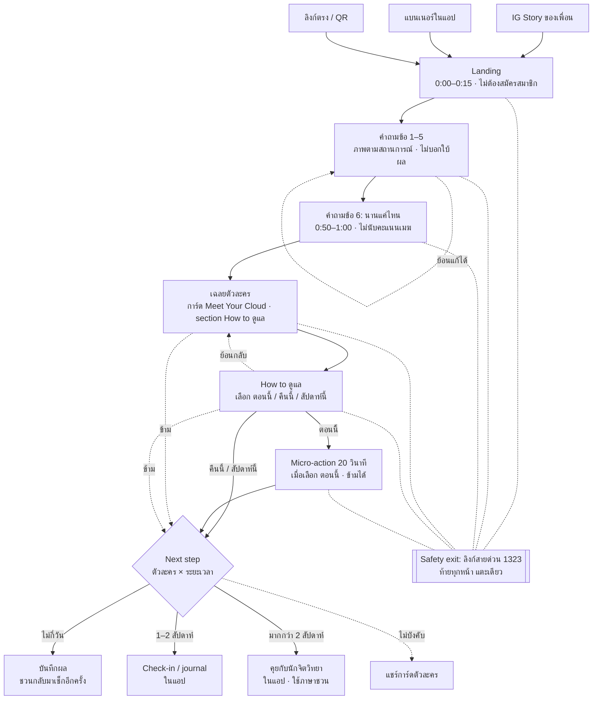

# User Flow: 2 นาทีของแพร

แพรผ่าน 7 หน้าจอเรียงต่อกันใน 2 นาที (หน้า How to ดูแล และ micro-action ข้ามได้) มีทางแยกจุดเดียวคือ next step ที่ขึ้นกับชนิดเมฆและระยะเวลา ส่วน safety exit เข้าถึงได้จากทุกหน้า

## Flow ภาพรวม

Humi ได้ข้อเสนอแบบเบาเสมอ ส่วนเมฆอื่นดูที่ระยะเวลา รายละเอียดอยู่ใน next-step matrix ของ `overview.md`

## รายละเอียดรายหน้าจอ

| # | หน้าจอ | เวลา (เป้า) | เนื้อหาหลัก | Interaction | หมายเหตุ |
| --- | --- | --- | --- | --- | --- |
| 1 | Landing | 0:00–0:15 | "วันนี้เพื่อนเมฆตัวไหนจะมาเยือนคุณ?" ใช้ 2 นาที ไม่ต้องสมัคร disclaimer | เพื่อนเมฆ 4 ตัวยืนเรียงกัน (ไม่ขยับ) ป้าย "ใครจะมาเยือนคุณ เฉลยตอนจบ" กดเริ่มปุ่มเดียว | – |
| 2 | คำถามข้อ 1–5 | 0:15–0:50 | สถานการณ์งานพร้อมภาพประกอบ 4 ตัวเลือกสลับลำดับ | แตะเลือกแล้วไปข้อถัดไป ย้อนกลับได้ | ไม่บอกใบ้ผล พื้นหลังเป็น `gray-50` ตลอด |
| 3 | คำถามข้อ 6 | 0:50–1:00 | "ถ้าช่วงนี้คุณรู้สึกเหนื่อยหรือหนักใจเรื่องงาน ความรู้สึกนี้อยู่กับคุณมานานแค่ไหนแล้ว?" | แตะเลือก 1 ใน 4 | ไม่เปลี่ยนตัวละคร ใช้กับ next step |
| 4 | เฉลยตัวละคร | 1:00–1:35 | การ์ด Meet Your Cloud: รู้จัก, พลังพิเศษ, จุดเด่น, เมื่อพลังล้น, How to ดูแล (คำอธิบายสั้น + ปุ่มหลัก), reframe, เพื่อนซี้ | ภาพเปลี่ยนเป็นตัวละครที่มาเยือน กด "เลือกวิธีดูแล [ชื่อ]" ใน section How to ดูแล ส่งการ์ดให้เพื่อน หรือข้ามไปก้าวต่อไป | อ่านครบราว 35–50 วินาที ต้องจับเวลาจริง |
| 5 | How to ดูแล | 1:35–1:40 | "เลือกหนึ่งอย่างที่คุณจะลอง" ตอนนี้ / คืนนี้ / สัปดาห์นี้ | เลือก 1 ใน 3: ตอนนี้ → เริ่มเลย 20 วินาที, คืนนี้/สัปดาห์นี้ → บันทึกคำสัญญา ตั้งเตือนได้ แล้วไปก้าวต่อไป | ย้อนกลับไปการ์ดได้ ข้ามได้ |
| 6 | Micro-action | 1:40–2:00 | กิจกรรม 20 วินาทีตามตัวละคร (เมื่อเลือก "ตอนนี้") | หายใจ / วางลง / grounding / จด | ข้ามได้ |
| 7 | Next step | 2:00+ | สิ่งที่เลือกจะลอง + ข้อเสนอตามตัวละคร × ระยะเวลา | ปุ่มหลัก, ส่งการ์ดให้เพื่อน, เล่นอีกครั้ง | ไม่มีหน้าจองหรือราคา |
| 8 | การ์ดแชร์ | ไม่บังคับ | ตัวละคร, ฉายา, พลังพิเศษ, รู้ไหม | แชร์หรือคัดลอกข้อความ | ไม่มีข้อมูลส่วนตัว |

### ภาพประกอบหน้าคำถาม

| ข้อ | ภาพ |
| --- | --- |
| 1 | นั่งหน้าแล็ปท็อป อีเมลแจ้งเตือน 40 ฉบับ ป้าย "จันทร์" |
| 2 | ถือโทรศัพท์ตอนกลางคืน 20:00 ข้อความจากหัวหน้า |
| 3 | พักเที่ยง ชามอาหาร นาฬิกาเที่ยงตรง |
| 4 | ข้อความเพื่อน "ไปเที่ยวเสาร์นี้ไหม" กระเป๋า ภูเขา |
| 5 | นอนห่มผ้าคืนวันอาทิตย์ พระจันทร์ |
| 6 | ปฏิทินที่ระบายสีหลายวัน |

**Safety exit ทุกหน้า:** มีลิงก์ท้ายจอ "ถ้าตอนนี้รู้สึกหนักเกินรับไหว" ที่พาไปสายด่วนสุขภาพจิต 1323 ได้ในหนึ่งแตะ
